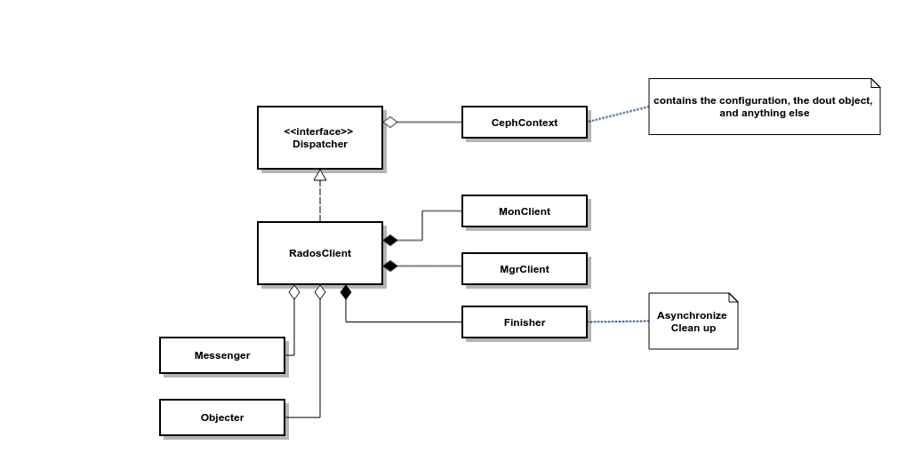

## Introduction
The RadosClient class act as major role between client and Ceph cluster node communication.

## Class diagram

I skip lot of detail information. 

## Connect to cluster

Inside `librados::RadosClient::connect()`, it will perform following steps.

1. Initial the **MonClient** and fetch monitor map & config.
2. Create **Messenger** instance based on pre-config type.
3. Create **Objecter** instance and call `Objecter::init()`
